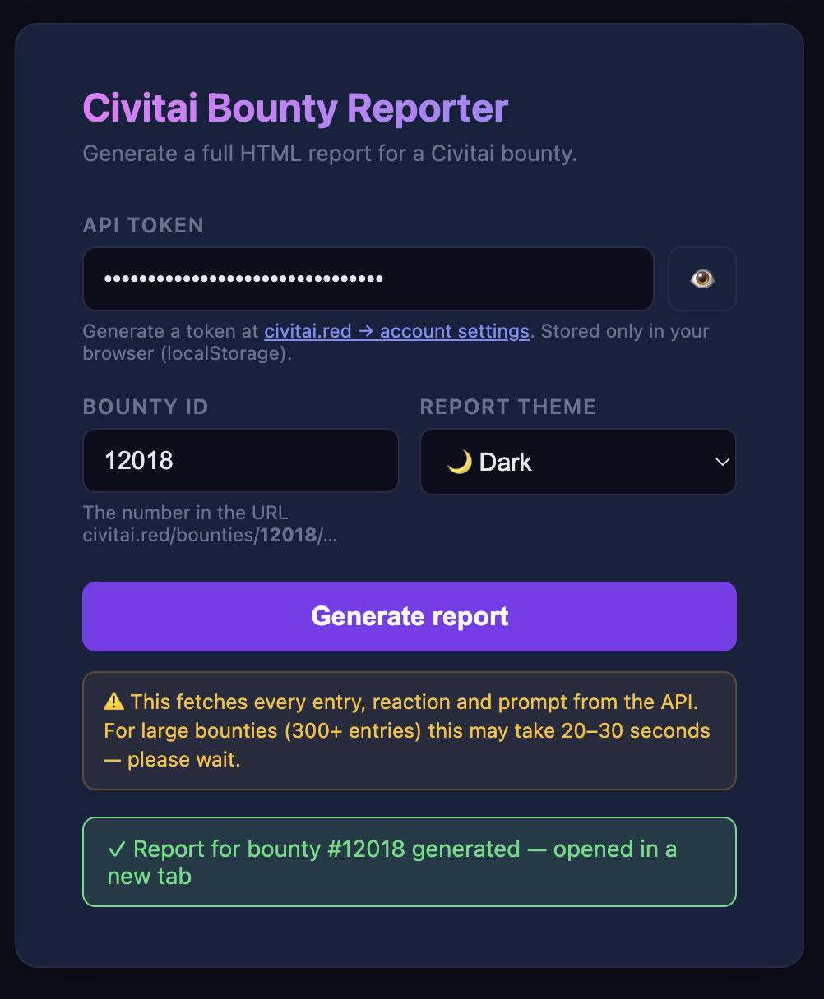
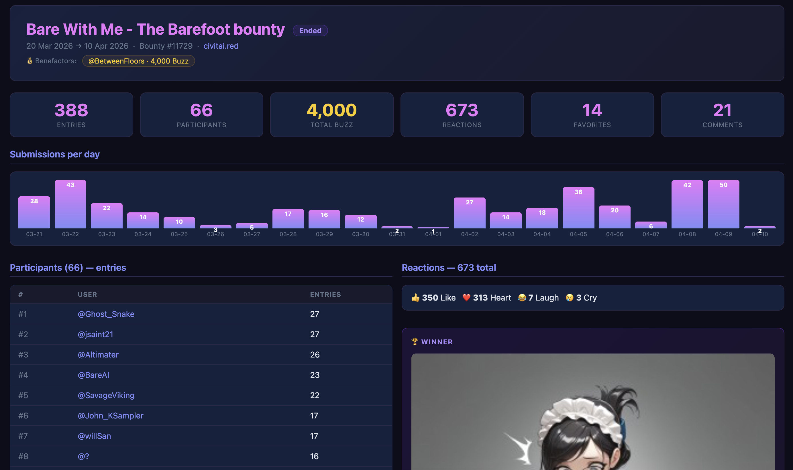
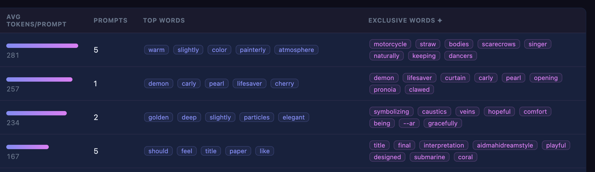
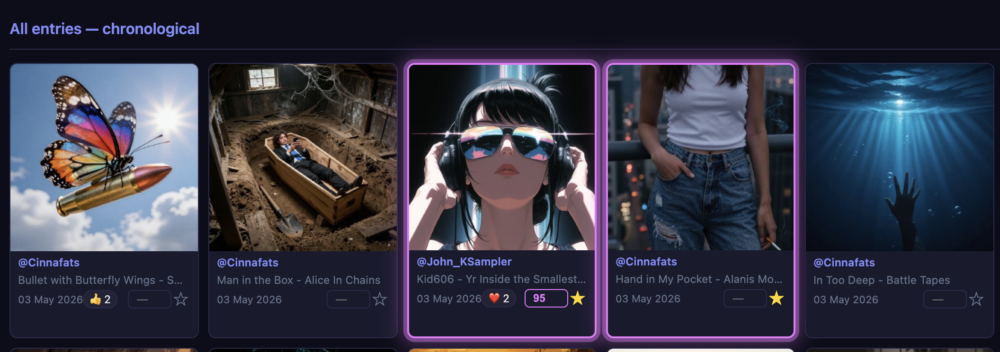
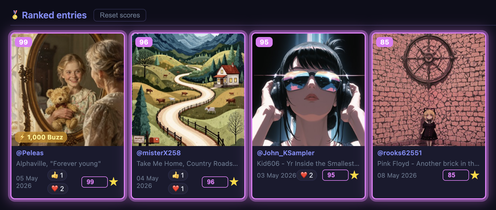

# civit_bounties

Python client for the [Civitai](https://civitai.red) bounty API.  
Fetches participation statistics, reactions, and prompt data, and generates a self-contained HTML report.

> **Note:** Civitai bounties are only active on `civitai.red` (not `civitai.com`).

## Requirements

- Python 3.10+
- `requests`

## Installation

```bash
git clone https://github.com/BetweenFloors/civit_bounties.git
cd civit_bounties
pip install .
```

Get your API token at **civitai.red → account settings → API keys**.

## Usage

### Web UI (recommended)

```bash
civitai-server
```

Opens `http://localhost:8000` automatically. Enter your API token and bounty ID, choose a theme — the report opens in a new tab. No configuration needed.

> **⚠️ Note:** The report fetches every single entry, reaction, and prompt from the API. For large bounties (300+ entries) this can take 20–30 seconds. Don't close the tab while loading.



### CLI

```bash
# Console stats only
civitai --token YOUR_TOKEN bounty 12018

# Generate an HTML report
civitai --token YOUR_TOKEN bounty 12018 --html report.html

# Or use an environment variable
export CIVITAI_TOKEN=YOUR_TOKEN
civitai bounty 12018 --html report.html
```

### Python

```python
from civitai import Civitai
from civitai.report import generate_html

civ = Civitai(api_token="YOUR_TOKEN")

# Quick stats
stats = civ.bounties.get_stats(12018)
print(stats.entries, stats.total_buzz)

# Full report (entries + reactions + prompt analysis)
report = civ.bounties.full_report(12018)
generate_html(report, 12018, "report.html")
```

## Interactive features (report UI)

Once a report is open, several tools are available for bounty organizers:

### ★ Highlights
Mark entries of interest directly on their thumbnail using the **★** button, or paste a list of entry URLs into the **🔖 Highlight entries** modal (one URL per line — any text after the URL is ignored). Opening the modal always pre-fills with currently highlighted entries, so you can combine both methods freely.

Use **★ Highlights only** (next to "🕐 Timeline view") to hide all non-highlighted entries. Works in both participant view and timeline view.

### 🏅 Scores
Each thumbnail has a small score field (0–100). Fill in scores directly on the cards. Click **🏅 Sort by score** to open a ranked view of all scored entries, sorted highest first. A **Reset scores** button is available inside that view.

### 💾 Saving
Scores and highlights are **not saved automatically**. Click **💾 Save scores & highlights** to persist everything. Data is written to:

```
export/{bounty_id}.json
```

This file is loaded automatically the next time you generate a report for the same bounty — scores and highlights are restored without any extra steps.

> **Note:** The `export/` folder is local only and excluded from git.

## How it works

All processing runs locally. The CLI and server both make requests directly to `civitai.red` using your token — nothing goes through a third-party. The local server exists only to bypass browser CORS restrictions; the generated HTML is self-contained and never uploaded anywhere.

## Example report

- [`examples/bounty_11729.html`](examples/bounty_11729.html) — 300+ entries, dark theme
- [`examples/bounty_11541_light.html`](examples/bounty_11541_light.html) — light theme

## HTML report contents

| Section | Description |
|---|---|
| Stats grid | Entries, participants, Buzz, reactions, favorites, comments |
| Daily chart | Submissions per day |
| Participants table | Ranked by entry count |
| Reactions table | Who reacted, reaction type breakdown |
| Prompt analysis | Avg token length per user, frequent words, exclusive vocabulary |
| Participant cards | One card per user with all their image thumbnails and reactions |

## Screenshots


*bounty details, daily chart, participants, winner...*


*prompt analysis: average token count, top words, and exclusive vocabulary*


*highlighted entries with star toggle and "Highlights only" filter*


*per-entry scoring and ranked view*
